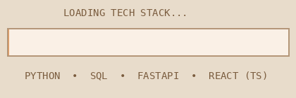

---

## 🌸 About Me  

👩‍💻 Backend Developer  
🤖 AI Builder  
✍️ Aspiring Writer  
☁️ Working with Google Cloud Platform (GCP)  

---

## 🍰 My Projects  

🍽 **AI Food Menu Generator**  
Smart dynamic restaurant menu using AI  

🧠 **AI Discussion Hub**  

📊 **Analytics Dashboard**  

---

## ☕ Tech Stack  

  

🐍 Python &nbsp;•&nbsp; 🗄 SQL &nbsp;•&nbsp; ⚡ FastAPI &nbsp;•&nbsp; ⚛ React (TypeScript) &nbsp;•&nbsp; ☁️ GCP  

---

## 🌱 Currently Steeping In  

🧠 Advanced Backend Architecture  
🤖 AI Automations & Integrations  
☁️ Google Cloud Platform  
📖 Becoming a Published Author  

---

## 📊 GitHub Stats (Beige Theme)

---

## 💌 Reach Me At  

📧 **your_email_here**  
💼 **your_linkedin_here**  
🐙 https://github.com/Shravani253  

---

☕ *"She codes gracefully and writes her own story."* ✨  

